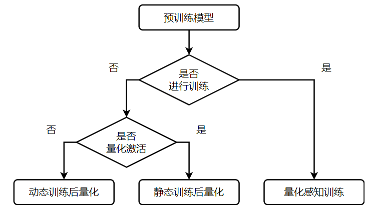

大语言模型正在深刻改变人工智能的应用格局。从ChatGPT到Claude，从编程助手到智能客服，这些模型在展现惊人能力的同时，也带来了前所未有的计算挑战。一个典型的GPT-3模型包含1750亿参数，推理一次需要数百GB显存，单次查询的计算成本可达数美元。更关键的是，随着应用场景从云端向边缘扩展，如何在资源受限的环境中高效运行大模型，已成为制约技术落地的核心瓶颈。

推理加速不仅仅是速度问题，更关乎商业可行性、用户体验和环境可持续性。据估算，ChatGPT每天响应数亿次请求，如果推理效率提升一倍，不仅能节省数千万美元的运营成本，还能减少相当于数千吨的碳排放。对于自动驾驶、机器人控制这类实时应用，推理延迟从秒级降到毫秒级，意味着从"不可用"到"可部署"的质变。

本文将系统梳理大语言模型推理加速的完整技术图谱，涵盖模型压缩、解码优化、系统架构到专用硬件的各个层面，既关注学术前沿的突破性研究，也追踪工业界的最新实践，力图为研究者和工程师提供一份全面、深入且具有实践指导意义的技术地图。

------

## 引言：为什么大模型推理需要加速

随着大型语言模型（Large Language Models, LLMs）如GPT系列、Llama系列和Grok系列的快速发展，它们在自然语言理解、生成和多模态任务中的表现日益出色。然而，这些模型的参数规模从数亿到数万亿，导致推理过程计算密集型和内存消耗巨大。在实际部署中，尤其是边缘设备和实时应用场景，面临速度慢、存储有限和能耗高的挑战。大模型推理中存在的典型问题包括：

- **延迟高**：自回归生成使 decode 阶段成为串行瓶颈
- **内存占用大**：模型参数 + KV Cache 的总占用使得高并发困难
- **能耗高**：推理功耗往往占到 LLM 商业化成本的主要部分、
- **边缘部署困难**：资源受限设备难以支撑 FP16/F32 重型计算

尤其在 **长上下文、大批次、高并发** 场景下，推理成本会呈指数式上升。

## 一、大模型推理流程与性能瓶颈

### 1.1 推理过程解析

在谈加速之前，必须理解 LLM 推理独特的**两大阶段**：

1. **Prefill（预填充阶段）**：模型接收完整的输入提示词，并行处理所有token，计算出KV Cache。这是一次性的计算，**属于计算密集型 (Compute-bound)任务**，GPU 的利用率通常较高。
2. **Decode（解码阶段）**：自回归地逐个生成输出 Token。每次生成都需要访问之前累积的键值缓存。这个阶段的特征是**内存密集型操作**，受限于内存带宽而非计算能力。
   - **瓶颈**：每次生成一个 Token 都需要加载全部的模型权重和 KV Cache，但计算量却很小（Matrix-Vector Multiplication）。
   - **本质**：这是典型的**内存带宽受限 (Memory-bound)** 场景。你的 H100 算力再强也没用，因为时间都花在把数据从 HBM（高带宽显存）搬到计算单元的路上了。

这两个阶段的性能瓶颈截然不同。在实际应用中，当输入长度为128到256个token，输出超过32个token时，**解码阶段往往占据总推理时间的80%以上**。这意味着仅仅提升计算速度对整体性能的改善有限，必须从内存访问、数据流动的角度进行系统优化。更复杂的是，不同应用场景下这两个阶段的重要性权重差异巨大。聊天应用需要低延迟的首token生成，文档总结则更关注整体吞吐量，实时翻译要求稳定的逐token输出速度。

> **2025 新趋势**：随着 OpenAI o1 等“推理时计算 (Inference-time Compute)”模型的出现，通过 CoT (思维链) 让模型“多思考”会导致输入 token 数暴增，这使得 Prefill 阶段的占比和优化重要性正在重新上升。

### 1.2 计算瓶颈的本质

大语言模型推理的核心计算是矩阵乘法和注意力机制。在预填充阶段，矩阵乘法占据主导，这是一个计算密集型操作，可以通过增加计算单元来加速。但在解码阶段，情况发生了根本变化。虽然每次仍然需要进行矩阵乘法，但矩阵的一个维度退化为1，变成了矩阵向量乘法。此时，从内存加载权重的时间远超计算本身，形成所谓的"内存墙"问题。

注意力机制的复杂度随序列长度呈二次增长，这在处理长文本时会成为严重瓶颈。一个包含16k token的文档，其注意力计算量是1k文档的256倍。更隐蔽的问题是键值缓存的爆炸式增长。对于Llama-70B这样的模型，单条序列的KV缓存可能占用数GB内存，这使得批处理大小受到严重限制，直接影响吞吐量。当我们试图在单个GPU上服务更多用户时，很快会遇到内存容量的硬性约束。

### 1.3 性能评估的多维视角

评估推理性能需要超越简单的速度指标，建立多维度的评价体系。首先是延迟指标，包括首token延迟和逐token延迟。前者决定了用户感知的响应速度，后者影响了流式输出的流畅度。在对话应用中，首token延迟超过一秒会明显影响体验，而逐token延迟如果超过50毫秒，用户会感到输出"卡顿"。

吞吐量指标关注的是系统整体的服务能力，通常用每秒生成的token数量或每秒处理的查询数量来衡量。这在批处理场景和多用户服务中至关重要。一个有趣的现象是，优化延迟和优化吞吐量往往存在权衡。小批量推理能降低延迟但牺牲吞吐量，大批量推理则相反。

能效比正在成为越来越重要的指标，用每焦耳能量生成的token数量来衡量。随着大模型应用规模扩大，电力成本和碳排放成为不可忽视的因素。在边缘设备上，能效比直接决定了电池续航和散热设计。数据显示，不同硬件平台的能效比差异可达三个数量级，而优化良好的系统能在相同硬件上获得十倍以上的能效提升。

资源利用率同样关键，包括计算单元利用率、内存带宽利用率和缓存命中率。许多系统的GPU利用率仅有30-40%，这意味着大量硬件能力被浪费。优秀的推理系统应该能将利用率提升到70%以上，这通常需要算子融合、异步执行等深度优化技术。

- **吞吐量（Throughput）**：tokens/s，衡量单位时间生成的token数量
- **延迟（Latency）**：生成单个token的时间，对实时应用至关重要
- **能效比（Energy Efficiency）**：tokens/J，每焦耳能量生成的token数量
- **首token延迟（TTFT）**：从请求到第一个token的时间

- **批处理效率**：不同batch size下的性能表现

**推理性能瓶颈总结：**

| 阶段    | 主要瓶颈                        | 工程优化方向                                            |
| ------- | ------------------------------- | ------------------------------------------------------- |
| Prefill | 算子并行度不足、显存/访存压力大 | FlashAttention、并行参数化等                            |
| Decode  | 串行瓶颈、KV Cache IO 压力      | Speculative decoding, paged KV, faster decoding kernels |

## 二、模型压缩：给模型“瘦身”与“抄近道”

在硬件资源有限的情况下，软件层面的优化主要集中在减少计算量（剪枝/投机）和降低显存占用（量化/KV Cache 优化）。

### 2.1 量化 (Quantization)

量化是目前性价比最高的加速手段，将高精度浮点数（FP32）转换为低比特格式（INT8/4、FP16/8），通过降低精度来换取速度和显存空间。

数值的量化可以看做一个近似过程，主要可以分为两类：

1. **定点近似**：通过缩小浮点数表示中指数部分和小数部分的位宽实现。映射过程不需要额外的参数，实现相对简单，但针对较大数值的精度损失较大。
2. **范围近似**：通过统计分析，经过缩放和平移映射浮点数。映射过程需要存储额外的参数，计算时需要先反量化，计算相对复杂，但精度更高。

范围近似又可以分为**线性映射**和**非线性映射**两种。

**线性映射**将浮点数映射到量化空间时采用如下计算公式：
$$
r=S(q-Z) \tag{1}
$$

$$
q=round(\frac{r}{S} + Z) \tag{2}
$$

其中，r，q分别表示量化前和量化后的值，S，Z为量化系数。一般化的非对称映射如下图所示：

其中，
$$
S=\frac{r_{max}-r_{min}}{q_{max}-q_{min}} \tag{3}
$$

$$
Z=q_{min} - \frac{r_{min}}{S} \tag{4}
$$

**非线性映射**考虑了数据本身的分布情况。以分位量化方法为例，其基本思想是通过分位点对数据进行划分，使得各个区间之间的数据量相等，然后将同一个区间的数据映射为相同值，从而实现量化。

**量化粒度**是指控制多少个待量化的参数共享一组量化系数，通常粒度越大，精度损失越大。以 Transformer 模型为例，不同粒度的量化方式如下图所示：

其中，$d$ 为模型大小与隐层维度之比，$h$为多头自注意中的头数。

根据是否进行训练可以将量化方法分为两大类，如下图所示：

1. **PTQ (Post-Training Quantization)**：训练后量化，无需重训，直接基于校准数据进行量化，是目前 LLM 的主流选择（如 GPTQ, AWQ）。
2. **QAT (Quantization-Aware Training)**：量化感知训练，在训练中模拟量化误差，精度更高但成本巨大。

三种不同量化方法之间的差异如下图所示：

根据量化类型的不同，又可以分为：

- **Weight-Only (仅权重)**：仅对模型权重进行量化，激活值保持高精度，适合显存受限场景（如手机端）。
  - 仅权重量化是当前**应用最广泛**的方案。这种方法只对模型参数进行量化，而保持激活值的高精度，从而简化了实现并保证了较好的精度。GPTQ是这个领域的奠基性工作，它基于二阶信息进行一次性量化，能够将175B参数的模型压缩到3-4bit而几乎不损失性能。其关键创新在于利用Hessian矩阵的近似来指导量化过程，优先保护那些对模型输出影响最大的权重。实验表明，经过GPTQ量化的OPT-175B在单个A100上能达到14.1 tokens/s的速度，相比FP16版本在5个GPU上的表现快了3.25倍。
  - AWQ带来了另一个视角的创新。它观察到虽然大部分权重可以安全地量化，但有约1%的"显著权重"对模型性能至关重要，这些权重往往对应着极大的激活值。AWQ通过per-channel的缩放保护这些关键权重，在Llama2-7B上将推理速度从52 tokens/s提升到194 tokens/s，这在RTX 4090这样的消费级GPU上实现了近4倍加速。更重要的是，AWQ使得13B模型能够在8GB显存的笔记本GPU上运行，这对于模型的部署意义重大。
  - SpQR进一步推进了这个思路，它识别出异常值权重并用16bit单独存储，而将其余99.9%的权重压缩到3-4bit。这种"异常值感知"的量化在小模型上特别有效，能够将1-10B参数的模型量化后的困惑度损失控制在1%以内。SqueezeLLM则采用了非均匀量化策略，根据权重的重要性动态分配bit宽，并用稀疏格式存储异常值，在A6000上实现了63.5 tokens/s的推理速度。
- **Weight-Activation (全量化)**：同时量化权重和激活值，难度要高得多，但潜在收益也更大。当权重和激活都量化到低精度时，可以直接使用INT运算单元，而不需要反量化到FP进行计算。这能充分发挥现代硬件的低精度算力优势。
  - SmoothQuant解决了激活值量化的核心难题。它发现激活值中的异常值是量化的主要障碍，通过一个数学等价的变换，将量化难度从激活迁移到权重。这个变换是离线完成的，推理时不引入额外开销。W8A8方案在保持精度的同时获得了1.56倍加速和2倍的内存节省。
  - QUIK实现了更激进的W4A4量化，这是首次在权重和激活都采用4bit的情况下保持了良好性能。它的策略是将大部分权重和激活压缩到4bit，同时保留少量异常值用8bit表示。配合高度优化的CUDA kernel，QUIK在预填充阶段相比FP16实现了3.4倍加速。Atom进一步优化了这个方向，通过混合精度和细粒度量化，在RTX 4090上将端到端吞吐量提升了7.73倍，同时满足了相同的延迟目标。

- **KV Cache 量化**：是一个容易被忽视但影响巨大的优化点。在长序列生成时，KV缓存可能占据大部分显存。但简单地对KV缓存进行统一量化会导致显著的精度损失。
  - 最新研究发现，**少数"异常token"的键值对模型输出有决定性影响**，它们的分布特征与其他token显著不同。通过在解码过程中动态追踪这些异常token并排除在量化之外，可以在压缩KV缓存的同时保持精度。这种方法使得Llama2-7B在A100上达到480 tokens/s，同时将内存占用减少了一半。
- **浮点量化 - 新宠 FP8**：相比整数量化，浮点格式能更好地处理长尾分布和钟形分布，这正是深度学习中权重和激活的典型特征。随着 NVIDIA H100/B200 对 FP8 的原生支持，**FP8 正在取代 INT8 成为服务端推理的主流选择**，因为它保留了浮点数的动态范围，精度损失极小。FP6和FP4则是学术界探索的方向。FP6-LLM在A100上为Llama2-13B实现了约55 tokens/s的速度，证明了非标准精度的可行性。LLM-FP4将这个想法推向极致，在权重和激活都使用4bit浮点的情况下，精度损失几乎可以忽略。

### 2.2 稀疏化（Sparsity）

神经网络的过参数化特性意味着存在大量冗余，稀疏化通过识别并移除这些冗余来加速推理。与量化不同，稀疏化直接减少了计算量，而不仅仅是降低精度。但稀疏化的挑战在于如何高效地利用稀疏性，不规则的数据访问模式往往会抵消计算量减少带来的收益。

稀疏化可以分为下面几种：

- **权重稀疏**：剪去非重要权重
- **激活稀疏**：跳过激活值接近 0 的计算
- **Attention 稀疏**：精简注意力计算

#### 2.2.1 权重稀疏

权重剪枝是最直观的稀疏化方法，核心思想是在尽量保持模型精度不受影响的前提下减少网络的参数量，例如减少网络中连接或神经元的数量。

剪枝最常用的步骤如下：

1. **训练**：在整个剪裁过程中，该步骤主要为预训练过程，同时为后续的剪裁工作做准备。
2. **修剪**：通过具体的方法对网络进行剪裁，并对网络重新进行评估以确定是否符合要求。
3. **微调**：通过微调恢复由于剪裁对模型带来的性能损耗。

对网络进行剪裁的具体方法可以分为**非结构化剪枝**和**结构化剪枝**。

**非结构化剪枝**是细粒度的剪裁方法，一般通过设定一个阈值，高于该阈值的权重得以保留，低于该阈值的权重则被去除。非结构化剪裁虽然方法简单、模型压缩比高，但也存在诸多问题。例如：全局阈值设定未考虑不同层级的差异性，剪裁信息过多有损模型精度且无法还原，剪裁后的稀疏权重矩阵需要硬件层支持方可实现压缩和加速的效果等。

- SparseGPT和Wanda代表了两种不同的剪枝哲学。前者基于二阶信息进行迭代剪枝，需要复杂的权重更新过程；后者则简单地根据权重大小与对应激活值的乘积进行剪枝，完全不需要重训练。令人惊讶的是，Wanda在许多任务上的表现与SparseGPT相当，但实现简单得多。
- 非结构化剪枝压缩比高但需要专门硬件支持才能加速（否则只是存得小，跑得不快）。

**结构化剪枝**是粗粒度的剪裁方法，例如对网络层、通道、滤波器等进行剪裁。在滤波器剪裁中，通过评估每个滤波器的重要性（例如：Lp 范数）确定是否保留。结构化剪裁算法相对复杂、控制精度较低，但剪裁策略更为有效且不需要硬件层的支持，可以在现有深度学习框架上直接应用。

- LLM-Pruner采用结构化剪枝，根据梯度信息选择性移除耦合的网络结构，这保持了模型的可微分性，使得可以通过LoRA等参数高效微调技术快速恢复性能。实验显示，可以在一次性剪枝中达到50%的稀疏度而几乎不损失性能。

#### 2.2.2 激活稀疏

激活稀疏性提供了另一个优化维度。

传统的SwiGLU和GeGLU激活函数在大模型中**稀疏度有限**，简单替换为ReLU又会严重损害性能，下面两种是ReLU激活函数替换的方法：

- Turbo Sparse提出了dReLU激活函数，配合特殊的训练数据混合策略，使得Mistral-7B中只有35.7%的参数在推理时被激活。在Intel i9-14900HX上，这带来了8.71 tokens/s的推理速度。
- ProSparse通过渐进式稀疏正则化达到了更高的稀疏度，Llama2-7B实现了89.32%的激活稀疏性，配合PowerInfer框架在i7-12700K上获得了16.3 tokens/s的性能。

#### 2.2.3 注意力稀疏

针对Transformer注意力机制的二次复杂度进行优化：

**静态稀疏模式**，如StreamingLLM结合了初始token保留和滑动窗口，这基于一个有趣的发现：注意力机制对序列开头的token（attention sink）格外依赖，即使这些token在语义上不太重要。通过保留这些token并使用滑动窗口处理其余部分，可以在保持性能的同时处理任意长度的序列。

动态稀疏方法更加灵活但实现起来更加复杂：

- H₂O (Heavy Hitter Oracle)观察到少数"重磅token"对注意力分数贡献最大，它在推理过程中动态维护这些token的KV缓存，而逐步淘汰不重要的token。在T4 GPU上，H2O使得OPT-6.7B达到30.4 tokens/s，同时KV缓存大小仅为原来的20%。
- Sparse Flash Attention将稀疏性与FlashAttention的IO优化结合，支持key/query dropping和基于哈希的注意力，为长序列推理提供了可扩展的解决方案。

### 2.3 知识蒸馏 (Knowledge Distillation)

知识蒸馏通过将大模型的知识迁移到小模型来实现加速，这在保持性能的同时获得了更小的模型尺寸。与量化和剪枝不同，蒸馏产生的是一个新的模型，可以有不同的架构和参数量。对于需要在边缘设备长期部署的场景，蒸馏往往是最优选择。

架构优化：低秩分解为模型压缩提供了数学上优雅的解决方案。通过将大矩阵分解为若干小矩阵的乘积，可以显著减少参数量和计算量。LoRA在微调中广泛应用，但它的思想也可以用于**推理加速**。Tensor-Train分解将这个想法推向极致，通过级联的低秩矩阵表示原始权重，在FPGA上为Llama2-7B实现了65.8 tokens/s的性能。

## 三、解码策略：突破自回归的枷锁

### 3.1 投机采样（Speculative Decoding）

传统的 Decode 串行生成太慢，当前学术界和工业界都聚焦在 **突破 decode 串行瓶颈**。

投机采样利用了“大模型验证比生成快”的特性：

- **原理**：用一个极小的**Draft Model**（草稿模型）快速生成 5 个 Token，然后让大模型一次性验证这 5 个 Token。如果全对，就赚了 4 个步骤的时间；如果不对，就回退。
  - 经典的投机采样使用一个显著更小的draft模型来生成候选token。这个draft模型可能只有目标模型大小的十分之一，因此生成候选的成本很低。
  - 验证阶段：大模型可以并行计算所有候选token的概率分布，然后根据概率接受或拒绝每个候选。平均而言，这个过程能接受2-3个候选token，相当于每次大模型推理生成了多个token，实现了2-3倍的加速。

Lookahead Decoding提出了一个不需要训练draft模型的方案。它使用n-gram方法从模型的输出历史中检索候选token，这些候选基于统计规律生成，虽然质量不如专门训练的draft模型，但完全消除了额外的模型训练和部署成本。在A100上，Llama2-7B使用Lookahead Decoding达到了65-95 tokens/s，具体速度取决于数据集特征。

**多头预测架构**代表了另一个方向。Medusa在语言模型上添加了多个轻量级的解码头，每个头预测未来不同位置的token。这些头的训练成本远低于一个完整的draft模型，但能并行生成多个候选。配合**树形注意力机制**，Medusa可以同时验证多个候选序列，构建出一个预测树。Vicuna-7B在A100上达到了129.86 tokens/s，相比标准解码提升了2-3倍。EAGLE改进了这个思路，使用单层Transformer作为draft模型，并将模型的中间特征作为输入，这提供了比纯token embedding更丰富的上下文信息。

除此之外还有**自投机解码**：完全不需要额外模型，而是利用大模型自身的结构特征。Draft & Verify通过**跳过中间层**来生成draft，这基于一个观察：模型的浅层通常已经包含了足够的信息来做出合理的预测。

- Kangaroo将前几层作为draft模型，配合一个轻量的adapter来增强表示能力。LayerSkip在训练时使用层dropout，使得模型能够在早期层做出准确的预测，推理时可以在早期退出并在后续层验证。这些方法的优势是零额外参数，但需要在训练阶段做特殊处理。

**异步投机采样**是最新的发展方向。传统投机采样中，draft和verify是串行的，即先生成候选，再验证，然后重复。AMUSD打破了这个模式，让draft模型和verify模型在不同的GPU上异步执行。当verify模型在处理当前批次时，draft模型已经在生成下一批候选。这种流水线式的执行充分利用了多GPU资源，对于Llama3.1-8B，在两个A100上相比同步投机采样获得了71 tokens/s的额外提升。

PipeSpec将这个想法扩展到多级模型。它支持k个模型组成的层次化流水线，模型之间异步执行，轻量级的协调机制处理验证和回滚。对于Llama3.1的1B-8B-70B组合，PipeSpec在两个A100上达到了20.51 tokens/s，这对于如此大规模的模型来说是很可观的性能。

### 3.2 早期退出-动态深度

并非所有的输入都需要相同的计算深度。**简单的问题可能在浅层就能得出答案，而复杂的推理任务才需要动用模型的全部深度**。早期退出技术利用了这个观察，根据输入的难度动态决定计算深度。

AdaInfer提出在每一层后添加一个轻量级的退出判断器，它评估当前表示的"置信度"，如果达到阈值就提前输出结果。这个想法简洁但有效，在问答任务上，Llama2-7B在V100上达到了25.2 tokens/s。但naive的实现会在每层引入额外开销，这在浅层就退出的情况下可能得不偿失。

RAEE引入了检索增强来改进退出决策。它预先构建了一个token特征数据库，推理时检索相似的历史token，利用这些相似token的信息来指导当前token该在哪一层退出。这种"借鉴历史经验"的方式提高了退出决策的准确性，减少了因过早退出导致的精度损失。

Mixture-of-Depths采用了类似MoE的思想，但应用在深度维度而非专家维度。每一层都有一个路由器决定是否要执行这一层的计算，不同的token可以走不同的路径。这创造了一个token级别的动态深度网络，计算资源被动态分配给最需要的地方。虽然论文没有开源模型，但这个想法为未来的模型架构设计提供了新思路。

SpecEE将早期退出与投机采样结合。它用一个轻量级的预测器判断当前token是否适合早期退出，如果是，则在浅层输出；否则，继续计算并生成多个投机token。这种组合策略在EAGLE的基础上进一步提升了性能，Llama2-7B在A100上达到了124.66 tokens/s。

## 四、算子与系统优化

### 4.1 注意力计算的革命

注意力机制是Transformer的核心，也是推理的主要瓶颈之一。标准实现需要物化整个注意力矩阵，对于序列长度L，这需要O(L²)的内存。在处理长文本时，这会迅速耗尽内存。FlashAttention通过重新思考注意力的计算顺序，实现了突破性的优化。

**FlashAttention**的核心洞察是利用GPU的内存层次结构。它将Q、K、V**矩阵分块**，每次只将一个块加载到快速的片上内存SRAM中进行计算，然后更新累积的结果。这个过程需要精心设计的分块策略和在线softmax计算，但避免了将整个注意力矩阵写入慢速的HBM。实验表明，FlashAttention相比标准实现快2-3倍，且内存占用与序列长度呈线性关系而非二次关系。

FlashAttention-2进一步优化了并行策略和工作分配。它减少了非矩阵乘法操作的开销，这些操作虽然计算量小但难以充分利用GPU。通过更好的work partition，FlashAttention-2在长序列上相比一代又快了近2倍。

解码阶段的注意力计算有独特的特征：序列长度不断增长，但每次只生成一个token。FlashDecoding针对这个场景进行了专门优化。它在序列长度维度进行并行化，让多个线程块同时处理不同的K、V块。这在小batch size下特别有效，因为此时batch维度的并行度不足。FlashDecoding++进一步优化了softmax计算中的同步开销，通过统计分析预先确定一个全局最大值，避免了多个线程块之间的同步等待。在A100上，Llama2-7B达到了115.57 tokens/s，相比naive实现提升了3-4倍。

PagedAttention从另一个角度解决内存问题。它将**KV缓存组织成固定大小的页**，类似操作系统的虚拟内存。这允许非连续的内存分配，大大减少了内存碎片。更重要的是，它支持在多个请求之间共享相同的prompt prefix，这在实际服务中能节省大量内存。vLLM框架基于PagedAttention实现了高吞吐量的推理服务，在相同硬件上相比FasterTransformer吞吐量提升了2-4倍。

### 4.2 矩阵运算与算子融合

**矩阵运算：**

矩阵乘法是深度学习的基础算子，也是推理计算的主体。但在解码阶段，批量大小通常很小，矩阵的一个维度可能只有1或几个，这时标准的GEMM库性能不佳。TensorRT-LLM为此专门实现了GEMV优化，针对小batch的矩阵向量乘法进行了深度定制。它利用了GPU的共享内存和寄存器，减少了全局内存访问。在A100上，这使得Llama2-7B的解码速度达到98.19 tokens/s。

FlatGEMM进一步推进了这个方向。它采用细粒度的分块和双缓冲技术，将内存访问与计算重叠。关键的创新是启发式的算子选择机制，根据输入形状动态选择最优的实现。这种自适应性对于推理服务至关重要，因为batch size在运行时是动态变化的。

**算子融合：**

算子融合能显著减少内存访问开销。深度学习模型包含大量轻量级算子，如layer normalization、残差连接、激活函数等。如果每个算子独立执行，中间结果都需要写回内存再读取，这会成为严重的瓶颈。算子融合将**多个操作合并到一个kernel中**，中间结果保持在寄存器或共享内存中。

DeepSpeed和vLLM等框架都大量使用了算子融合。典型的融合模式包括：GEMM + bias + activation，layer norm + residual + dropout，QKV projection + split等。一个transformer block可能包含十几个独立算子，通过融合可以减少到4-5个kernel调用，这不仅减少了内存访问，还降低了kernel启动开销。

ByteTransformer强调了变长输入的优化。在实际应用中，不同请求的序列长度差异很大，简单地padding到统一长度会浪费计算。ByteTransformer实现了padding-free的attention和高效的变长GEMM，在处理变长batch时相比标准实现快1.5-2倍。

### 4.3 内存管理与调度

内存管理的优劣直接影响了推理系统的吞吐量和可靠性。朴素的静态内存分配会导致严重的碎片化，而动态分配又引入了额外的开销和不确定性。

连续批处理是提升吞吐量的关键技术。传统的静态批处理等待batch中所有请求完成才开始下一batch，这导致了严重的资源浪费，因为不同请求的完成时间差异很大。连续批处理允许已完成的请求立即离开，新请求马上加入，保持GPU始终满载。Orca首次提出了这个想法，后续的vLLM、TGI等框架都采用了类似机制。实验表明，连续批处理能将吞吐量提升2-10倍，取决于请求长度的分布。

KV缓存管理是另一个关键挑战。在服务多个请求时，KV缓存可能占据大部分显存。朴素的分配方案会为每个请求预留最大可能长度的内存，这导致了极大的浪费。PagedAttention的分页机制解决了这个问题，它只在需要时分配内存，并且支持缓存的换入换出。更进一步，prompt缓存技术识别多个请求间的公共prefix，只存储一份副本。在customer service等场景中，大量请求共享相同的系统prompt，prompt缓存能节省50%以上的内存。

异步执行和流水线是隐藏延迟的有效手段。数据传输、模型计算、采样等操作可以重叠执行。例如，在生成当前token时，可以异步地将下一层的权重预取到GPU。在多GPU场景中，张量并行的all-reduce通信可以与下一层的计算重叠。精心设计的流水线能将GPU利用率从40%提升到70%以上。

### 4.4 批处理与调度策略

批处理大小的选择是延迟与吞吐量的权衡。**小batch降低延迟但牺牲吞吐量，大batch增加吞吐但恶化尾延迟**。动态批处理根据系统负载自适应调整batch size，在低负载时保持低延迟，高负载时最大化吞吐量。

**优先级调度**对于多租户服务很重要。不同用户或应用对延迟的敏感度不同，付费用户可能期望更低的延迟。调度器需要在保证SLA的前提下最大化整体吞吐量。Sarathi等系统实现了细粒度的优先级控制，根据请求的deadline动态调整调度顺序。

**预测性调度利用请求的统计特征来优化决策**。例如，如果历史数据显示某类请求通常生成很长的输出，可以优先分配更多KV缓存容量，避免中途内存不足。如果检测到输入包含大量重复的prompt，可以提前触发缓存共享机制。

### 4.4 高效模型架构

Transformer的**二次复杂度**一直是长序列处理的瓶颈。虽然各种稀疏注意力方法缓解了这个问题，但改变架构本身可能更彻底。状态空间模型提供了一个有吸引力的替代方案。

Mamba通过选择性状态空间机制，在保持线性复杂度的同时获得了内容依赖的推理能力。这解决了传统SSM无法根据输入动态调整的局限。Mamba在长序列任务上的表现接近甚至超越Transformer，而推理速度快数倍。Mamba2进一步优化，通过状态空间对偶性框架统一了多种模型架构，实现了2-8倍加速。

混合架构可能是更现实的路径。Jamba结合了Transformer、Mamba和MoE，不同层使用不同机制。Transformer擅长捕捉局部依赖，Mamba处理长距离信息，MoE增加容量而不增加激活参数。这种组合继承了各自的优势，同时缓解了各自的弱点。在推理优化上，可以针对不同层采用不同策略：Transformer层用FlashAttention，Mamba层用专门的SSM加速器。

RWKV探索了RNN的现代复兴。它证明了RNN可以并行训练（像Transformer）同时高效推理（常数时间复杂度）。通过时间混合和通道混合机制，RWKV在多项任务上达到了与Transformer相当的性能。对于推理，RNN架构的优势明显：每个时间步的计算量和内存占用都是常数，不随序列长度增长。这使得RWKV特别适合长序列流式生成。

此外在学术界还有一些其他的探索：

- **注意力变体**：如Sparse Self Attention (SSA)，通过特征空间对齐全/稀疏注意力，提升长上下文外推，减少梯度更新不足。 Linear-Attention混合模型首次超越O(n²)全注意力，解码1M token加速6.3倍，内存减75%。
- **AFT (Attention-Free Transformer)**：位置偏置替代Q-K点积，**Linear Transformer**：O(L)复杂度
- **扩散-based LLM**：从Diffusion-LM（2022）到LLaDA（2025万亿token规模），支持全序列扩散和指令跟随。 Dream-7B引入上下文自适应噪声重调度，多步推理提升显著。 DiffuCoder针对代码生成，使用耦合GRPO RL优化。
- **混合/递归**：Recursive Language Models处理10M+ prompt token，通过递归推理。 LaViDa扩展到多模态，视觉缓存加速1.92倍。

- **轻量 Transformer**：MobileBERT、TinyLlama

## 五、推理框架：连接算法与硬件的桥梁

### 5.1 云端服务框架

**vLLM**通过PagedAttention革新了KV缓存管理，将连续批处理推向主流。它的核心创新是分页式内存分配，类似操作系统的虚拟内存。KV缓存被分割成固定大小的块，非连续分配，消除了内存碎片。更重要的是，多个序列可以共享相同的块，这在处理具有公共prefix的请求时节省大量内存。实验表明，vLLM在相同硬件上的吞吐量是FasterTransformer的2-4倍，并且能支持更大的batch size。

**TensorRT-LLM**代表了NVIDIA生态的最佳实践。它深度集成了CUDA、cuBLAS、cuDNN，充分利用Tensor Core和最新的硬件特性。对于Hopper架构，TensorRT-LLM能自动启用FP8推理和Transformer Engine。它还支持多种并行策略的组合：张量并行、流水线并行、数据并行，可以灵活配置以适应不同规模的模型和集群。在A100上，Llama2-7B达到98.19 tokens/s，这得益于针对小batch优化的GEMV kernel和高度融合的算子。

**Text Generation Inference**是Hugging Face推出的生产级服务。它用Rust实现核心推理逻辑，提供了比Python更好的性能和内存安全性。TGI的特色是易用性，与Hugging Face模型库无缝集成，支持一行命令启动服务。它实现了动态批处理、流式输出、graceful shutdown等生产特性。对于不需要极致性能但重视易用性的场景，TGI是很好的选择。

**DeepSpeed-Inference**聚焦超大模型的推理。ZeRO-Inference技术能将模型参数、KV缓存和中间激活在CPU和GPU之间动态offload。这使得在消费级GPU上运行数百亿参数的模型成为可能。例如，OPT-175B可以在8个A100上以合理的速度运行，而不需要专门的高端服务器。DeepSpeed的另一个优势是与训练框架的一致性，相同的代码库可以用于训练和推理，降低了迁移成本。

### 5.2 边缘部署框架

**llama.cpp**是边缘推理的明星项目。**纯C++实现，无需Python环境**，极大降低了部署门槛。它支持广泛的硬件：x86、ARM、Apple Silicon、NVIDIA GPU、AMD GPU，甚至WebAssembly。量化格式GGUF成为社区事实标准，Hugging Face上大量模型提供GGUF版本。在M2 Ultra上，Llama2-7B 4bit达到38 tokens/s（8核），在Raspberry Pi这样的微型设备上也能运行。llama.cpp证明了，经过精心优化，CPU也能高效运行大模型。

MLC-LLM采用了编译优化的路径。它基于Apache TVM，将模型编译为针对特定硬件的优化代码。这个过程可能需要几小时，但生成的代码性能接近手工优化。MLC-LLM支持iOS、Android、Web，使得在移动设备和浏览器中运行大模型成为可能。一个iPhone 14 Pro可以流畅运行Llama2-7B的量化版本，这在几年前是不可想象的。

ONNX Runtime提供了跨框架、跨硬件的统一接口。PyTorch、TensorFlow训练的模型可以导出为ONNX格式，然后在ONNX Runtime上推理，支持CPU、GPU、NPU等多种后端。微软投入大量资源优化ONNX Runtime，特别是在移动端和边缘设备上。对于需要支持多种模型和硬件的产品，ONNX Runtime提供了标准化的解决方案。

### 5.3 专用优化库

FlashAttention不仅是一个算法，也是一个高质量的CUDA实现。其kernel经过精心优化，充分利用了GPU的内存层次和计算资源。许多推理框架都集成了FlashAttention，作为注意力计算的标准实现。FlashAttention-2和FlashDecoding进一步针对不同场景优化，构成了一个完整的attention库。

cuBLAS和CUTLASS是NVIDIA提供的矩阵运算库。cuBLAS是高层API，易用但灵活性有限。CUTLASS是模板库，提供了构建高性能GEMM的building blocks，允许开发者定制数据类型、分块策略、线程映射等细节。许多推理框架使用CUTLASS实现自定义的矩阵运算kernel，以支持特殊的量化格式或稀疏模式。

Triton是一个新兴的GPU编程语言，旨在降低编写高性能kernel的门槛。与CUDA相比，Triton提供了更高层的抽象，自动处理内存管理和并行化。许多研究者用Triton实现新的优化算法，验证想法，原型开发周期比CUDA短得多。OpenAI的研究团队大量使用Triton，FlashAttention也有Triton版本的实现。

主流推理框架一览：

| **框架**                | **核心技术**                                                 | **适用场景**                   | **备注**                                             |
| ----------------------- | ------------------------------------------------------------ | ------------------------------ | ---------------------------------------------------- |
| **vLLM**                | **PagedAttention**, Continuous Batching                      | 高并发服务端，适合在线服务     | 开源社区首选，吞吐量大，兼容 HF 生态                 |
| **TensorRT-LLM**        | Kernel 深度融合, **In-flight Batching**                      | 极致性能追求者，企业级部署首选 | NVIDIA 官方出品，针对 H100/A100 压榨到极致           |
| **SGLang**              | **RadixAttention**                                           | 复杂 Agent/CoT 场景            | 针对多轮对话和结构化输出优化，自动复用 KV Cache 前缀 |
| **llama.cpp**           | **GGUF**, CPU/Apple Silicon 优化                             | 端侧/本地部署                  | 让 Mac 和安卓手机跑大模型的功臣，支持极低比特量化    |
| **DeepSpeed-Inference** | Zero分布式推理(Zero Redundancy Optimizer)-去冗余的数据并行方案, Sparse Attention | 多GPU、大模型切割              | 微软开源，异构推理支持                               |

## 六、硬件加速：专用设计的威力

软件优化有上限，硬件架构决定下限。

| 硬件类型        | 优点             | 缺点           | 典型场景     |
| --------------- | ---------------- | -------------- | ------------ |
| **CPU**         | 通用、功耗低     | 吞吐低         | 边缘、小模型 |
| **GPU（主流）** | 并行强、生态成熟 | 能耗高         | 云推理主力   |
| **FPGA**        | 可定制、能效好   | 研发难         | 特殊边缘场景 |
| **ASIC/LPU**    | 极致能效与吞吐   | 成本高、生态弱 | 数据中心     |
| **PIM/NDP**     | 访存优势         | 仍在成熟期     | 未来趋势     |

### 6.1 GPU：依然是霸主 (NVIDIA H100/B200)

- **优势**：CUDA 生态护城河，HBM3e 提供超高带宽（3.35 TB/s+）。
- **稀疏计算**：Ampere 架构后支持 **2:4 结构化稀疏**，硬件层面直接让计算量减半。
- **瓶颈**：依然受限于“内存墙”，对于 Batch Size=1 的超低延迟场景，GPU 利用率往往很低。

GPU凭借其强大的并行计算能力和成熟的软件生态，目前仍是大模型推理的首选平台。NVIDIA在这个领域占据主导地位，其Tensor Core架构针对深度学习进行了专门优化。

从Volta到Ampere再到Hopper，GPU的演进清晰地展现了为大模型定制的趋势。V100引入了第一代Tensor Core，支持混合精度计算。A100增加了对INT8、TF32等格式的支持，并将内存带宽提升到1.5TB/s。H100则带来了革命性的Transformer Engine，能够自动在FP8和FP16之间切换，在保持精度的同时将吞吐量提升2倍。更重要的是，H100的内存带宽达到3.35TB/s，这对于内存密集型的解码阶段至关重要。

但GPU并非没有局限。其通用性导致了一定的效率损失，大量晶体管用于控制逻辑和缓存，真正用于计算的占比有限。功耗也是一个严峻挑战，H100的TDP达到700W，这对数据中心的供电和散热提出了极高要求。在边缘场景，**GPU的能效**比往往不及专用硬件。

消费级GPU为大模型的民主化做出了贡献。RTX 4090虽然是游戏卡，但其24GB显存和660 TFLOPS算力使其成为个人研究者和小团队的热门选择。在经过适当优化后，单卡4090可以运行Llama2-7B的4bit量化版本，达到近200 tokens/s的速度。这使得大模型研究不再是大公司的专利。

### 6.2 CPU：通用计算的潜力

CPU在推理加速中常被低估，但它们具有独特的优势：无处不在的部署、强大的可编程性、不断增强的AI能力。现代CPU通过**集成专用加速单元来提升AI性能**，这种异构设计兼顾了通用性和效率。

Intel的AMX指令集是一个代表性例子。它为矩阵运算提供了硬件加速，在Sapphire Rapids等第四代Xeon处理器上，AMX能将INT8矩阵乘法的性能提升8倍。配合Neural Compressor的自动量化，Llama2-7B在单路Xeon上可以达到12.5-50 tokens/s，这对于很多企业级应用已经足够。

Apple Silicon展示了另一种可能性。M系列芯片集成了强大的Neural Engine，专门用于加速神经网络推理。M2 Ultra的Neural Engine提供约32 TOPS算力，配合统一内存架构，实现了CPU和AI加速器之间的零拷贝数据共享。T-MAC在M2 Ultra上为Llama2-7B实现了50 tokens/s（8核），这个性能已经接近一些小型GPU。

移动端SoC将异构计算发挥到极致。Qualcomm Snapdragon 8 Gen3集成了Hexagon NPU、Adreno GPU和Kryo CPU，三者协同工作。PowerInfer-2利用这种异构性，将热激活的神经元分配给NPU，冷激活的分配给CPU，Llama2-7B达到了11.7 tokens/s，这在智能手机上实现了实时的本地推理。

CPU的能效比在**边缘场景**尤为突出。T-MAC在Raspberry Pi 5上只需25W功耗就能实现6 tokens/s，能效比达到0.24 tokens/J。虽然绝对速度不及GPU，但对于不需要高吞吐量的边缘应用，这种低功耗方案更有吸引力。

### 6.3 ASIC：极致效率的追求

专用集成电路代表了性能和能效的极致追求。通过为特定工作负载定制硬件，ASIC能够实现远超通用处理器的效率。但高昂的流片成本和漫长的开发周期使得ASIC只适合大规模部署的场景。它们试图颠覆 GPU 的统治，核心逻辑是**用 SRAM 取代 HBM**。

Groq的LPU是商业化ASIC的标杆。其Tensor Streaming Processor架构采用功能切片设计，将**内存单元与计算单元交错排列**，最大化数据局部性。软件定义的通信网络基于Dragonfly拓扑，支持最多10,440个TSP的扩展，提供超过2TB的全局内存。关键的是，LPU实现了确定性延迟，端到端延迟小于3ms，这对实时应用至关重要。Gemma-7B在LPU上达到814 tokens/s，这个速度远超同等功耗的GPU。

- **效果**：Llama-2-70B 的推理速度能飙到 **300+ tokens/s**（GPU 只有几十），延迟极低，非常适合实时对话。
- **代价**：内存太小（几百 MB），跑大模型需要几百张卡级联，成本高昂。

Cerebras的晶圆级引擎走了一条极端的路线。WSE-3是有史以来最大的芯片，包含4万亿晶体管、90万个AI核心和44GB片上内存。这个巨大的芯片消**除了跨芯片通信的开销**，所有数据都在片上流动。Llama3-8B在WSE上达到2700 tokens/s的惊人速度，相比超大规模云快20倍。当然，**代价是15kW的功耗和极高的成本**，这只适合对性能有极致需求的场景。

学术界的ASIC研究探索了不同的设计权衡。MECLA提出子矩阵划分方法，通过分解大矩阵为源子矩阵和派生子矩阵，减少83.6%的内存访问和72.2%的计算。Llama2-7B在91.84W功耗下达到161 tokens/s，相比V100快6.74倍。Tender利用张量分解和运行时再量化，在28nm工艺下功耗仅7.17W就实现了53.33 tokens/s。

非线性函数单元的设计是ASIC的一个细节但重要的挑战。Softmax、GeLU等函数在数学上复杂，naive实现需要昂贵的指数和除法运算。ConSmax提出**用可学习的归一化参数替代max和sum操作**，将softmax转化为简单的查表，面积仅0.001mm²，功耗0.43mW。PICACHU设计了可重构的粗粒度加速器专门处理非线性操作，使得Llama2-7B相比A100获得2.4-3.3倍加速。

Mamba等非Transformer架构为ASIC设计带来新机遇。MARCA是首个专为Mamba设计的加速器，采用reduction alternative PE阵列架构，线性操作时启用reduction树，逐元素操作时bypass。可复用的非线性函数单元通过分解指数和激活函数为逐元素操作来复用PE。Mamba-2.8B以10.33W功耗达到23.78 tokens/s，能效比2.30 tokens/J。

在工业界，**Google TPU** 是少数被验证能在生产环境大规模运行最先进模型的硬件平台之一，初代TPU在2016年发布，主要针对推理优化，采用脉动阵列架构。256×256的矩阵乘法单元提供了92 TOPS的INT8算力，但仅支持推理。TPU v2引入了训练能力，45 TFLOPS的bfloat16性能和16GB HBM使其成为Google内部训练的主力。TPU v3进一步提升性能到90 TFLOPS（bfloat16），128GB HBM，并通过2D Torus互连支持大规模集群。

TPU v4标志着向Transformer架构的全面倾斜。275 TFLOPS的bfloat16算力，配合32GB HBM2e和1.2TB/s带宽，专门优化了矩阵乘法和点积运算。更重要的创新是3D Torus互连，相比v3的2D设计，提供了更高的bisection bandwidth，这对于大模型训练时的all-reduce通信至关重要。Google的PaLM模型（540B参数）就是在6144个TPU v4上训练的。

TPU v5系列分为v5e和v5p两个版本。v5e定位于推理和训练的成本优化，单芯片性能适中但能效比优秀。v5p则是旗舰产品，单Pod包含8960个芯片，提供exaFLOPS级别的计算能力。关键的改进是光互连技术的引入，芯片间通信延迟降低了3-5倍，这对于超大规模模型的分布式训练和推理都至关重要。

TPU在推理中有一些独特的优势：

- 确定性与低延迟：TPU架构的一个显著特点是确定性执行。不同于GPU的动态调度，TPU的脉动阵列确保了相同输入产生完全相同的执行时间。这对于需要可预测延迟的生产环境非常重要。Google的搜索、翻译等服务都依赖这个特性来保证用户体验的一致性。
- 系统级优化：Google通过Pathways系统实现了TPU集群的高效利用。Pathways支持跨Pod的模型并行和数据并行，动态分配计算资源。更重要的是，它实现了"persistent compilation"，模型一次编译后可以在不同输入形状下高效执行，这解决了动态shape带来的重编译开销。
  - 在Gemini等多模态模型的推理中，Pathways能够将**不同模态的处理映射到最合适的TPU子集**，视觉编码在一组TPU上执行，语言生成在另一组，通过高速互连交换中间结果。这种灵活的资源编排是通用GPU集群难以实现的。

当然也有一定的局限性：

- 生态系统封闭：TPU最大的劣势是生态封闭。只能通过TensorFlow或JAX编程，虽然这两个框架功能强大，但限制了开发者的选择。相比之下，CUDA生态已经有上万个库和工具，迁移成本是许多团队采用TPU的障碍。
- 灵活性受限：TPU针对矩阵运算高度优化，但对于不规则计算（如稀疏操作、动态控制流）支持有限。新兴的SSM、Mamba等非Transformer架构在TPU上的表现不如在GPU上充分优化。这种架构特化是双刃剑，在主流任务上是优势，但**限制了探索新架构的灵活性**。
- 可获得性：TPU通过云服务提供，没有本地部署选项。这对于数据敏感的场景（如医疗、金融）可能是问题。配额限制和排队等待也是实际使用中的痛点，特别是在需求高峰期。

在推理性能上，**TPU v5p与NVIDIA H100**处于同一梯队，具体优劣取决于工作负载。对于标准的Transformer推理，二者性能接近。但在稀疏推理、自定义算子方面，H100的CUDA生态提供了更多优化空间。

能效比方面，TPU通常领先10-30%。Google在Gemini的技术报告中透露，相同推理吞吐量下，TPU v5的能耗是对比GPU的60-70%。这个优势在大规模部署时转化为显著的运营成本节省。

### 6.4 FPGA：可编程的灵活性

FPGA通过可重构的硬件逻辑为LLM推理提供了灵活性与效率的平衡。相比ASIC，FPGA可以根据不同模型动态调整数据通路；相比GPU，它能实现更高的能效比和更低的延迟。

- **优势**：支持非标准的量化位宽（如 3-bit, 1.58-bit Ternary LLM），可以针对特定模型（如 Mamba, RWKV）定制流水线。
- **案例**：微软的 **FlightLLM** 在 FPGA 上利用稀疏化实现了极高的能效比。

FlightLLM展示了FPGA在LLM推理中的潜力。它设计了可配置的稀疏DSP链，支持不同的稀疏模式；提出了always-on-chip decode方案，将所有解码计算保持在片上，避免频繁的片外访存；实现了长度自适应的编译方法，大幅减少了不同序列长度下的重新编译开销。在Xilinx U280上，Llama2-7B达到55 tokens/s，在高端VHK158上更是达到92.5 tokens/s。

AccLLM将多种优化技术融合到一个FPGA设计中：2:4半结构化剪枝、W2A8KV4量化、稀疏注意力。这种激进的压缩使得它在U280上以仅33W功耗实现了164 tokens/s，能效比达到惊人的4.97 tokens/J。这是目前已知的最高能效比之一，超过了大多数GPU和ASIC设计。

边缘FPGA展现了不同的设计权衡。Zynq系列将ARM处理器与FPGA fabric集成，TeLLMe在功耗仅7W的KV260上，通过1.58-bit三值量化实现了9 tokens/s。这对于电池供电的边缘设备意义重大。MEADOW在ZCU102上以小于10W的功耗运行OPT-1.1B，虽然速度只有0.25-2 tokens/s，但极低的功耗使其适合永远在线的应用。

FPGA的挑战在于开发难度和工具链成熟度。与GPU的CUDA生态相比，FPGA的开发需要硬件设计知识，迭代周期更长。但随着高层次综合工具的进步，这个差距正在缩小。OpenCL、Vitis等工具使得软件工程师也能开发FPGA加速器。

### 6.5 存内/近数据计算：重新定义存储

存内计算（PIM）和近数据处理（NDP）代表了计算架构的范式转变。传统架构中，**数据在存储和计算单元之间频繁移动**，这消耗了大量能量和时间。PIM/NDP将**计算能力集成到存储器中或靠近存储器**，数据在产生地就地处理，大幅减少了数据搬运。

- **原理**：在 DRAM/HBM 颗粒内部集成简单的计算单元（ALU）。

现状：DRAM-based PIM是最接近实用化的方案。SK Hynix的AiMX基于GDDR6实现，每个内存通道集成了一个MAC阵列。AiMX-xPU系统组合1个H100 GPU和3个AiMX模块，OPT-30B在不同batch size下达到167-900 tokens/s。这个异构系统的关键是让**GPU处理计算密集的预填充阶段，而PIM处理内存密集的解码阶段**，发挥各自优势。

HBM-PIM提供了更高的带宽和集成度。TransPIM在HBM2架构上增加2.15mm²的逻辑，功耗约40W，GPT2相比RTX 2080Ti快22.1倍。SAL-PIM进一步优化，提出子阵列级并行，通过双缓冲和流水线最大化利用率，GPT2-Medium相比Titan RTX快1.83倍。关键挑战是平衡PIM计算单元的面积与内存容量，过多的逻辑会挤占存储空间。

异构PIM系统将PIM与传统加速器结合。NeuPIMs提出NPU-PIM协同，GEMM在NPU上执行，GEMV在PIM上执行，双行缓冲支持二者并发。子批次交错技术隐藏了二者之间的依赖。GPT3-7B达到约3000 tokens/s（batch=8），功耗76W，能效比约40 tokens/J。AttAcc更激进地将注意力层放在GPU，其余放在PIM，GPT3-175B相比纯GPU吞吐量提升2.81倍，能效提升2.67倍。

3D堆叠技术为PIM打开了新的空间。将计算逻辑层叠在存储层之上，通过硅通孔（TSV）实现超高带宽互连。一个原型在3nm工艺实现逻辑层，堆叠在3D DRAM上，Llama2-13B在预填充阶段达到163k tokens/s，功耗193W。虽然这还是实验室设计，但展示了3D集成的巨大潜力。

CXL（Compute Express Link）为PIM提供了标准化的互连协议。CXL-PNM设计了基于LPDDR5X的CXL内存，容量512GB，带宽1.1TB/s，集成了LLM推理加速器。OPT-13B达到42.68 tokens/s，功耗77.6W。CXL的优势是能将大容量内存和加速能力同时带给主机，而不需要昂贵的HBM。

最激进的PIM方案使用新型存储器。ReRAM和PCM等阻变存储器可以直接在交叉阵列中执行模拟矩阵乘法，利用欧姆定律和基尔霍夫电流定律天然实现加权求和。一个原型结合ReRAM analog PIM和3D-SRAM digital PIM，ReRAM处理量化的MVM，SRAM处理逐元素操作。相比GPU获得89倍加速和2537倍能效提升。但模拟计算面临精度和可靠性挑战，距离实用还有距离。

## 七、前沿趋势展望

### 7.1 推理时计算

OpenAI的o1模型开启了"推理时计算[]"的新范式。不同于传统模型的一次前向传播，o1在推理时进行多轮迭代推理，使用Chain-of-Thought、树搜索等技术深度探索解空间。这使得它在复杂推理任务上的表现大幅超越GPT-4，在AIME数学竞赛中正确率提升50%。但代价是推理成本增加10-100倍，一个查询可能需要数十秒甚至数分钟。

推理时计算改变了优化的重心。预填充阶段的占比从1.5%跃升到23.5%，因为需要反复输入中间推理结果。过程奖励模型（PRM）的验证占据21.7%的时间，这是全新的开销。解码仍占54.8%，但不再是压倒性主导。这要求推理系统对三个阶段进行均衡优化，不能只关注解码。

异步执行变得更加重要。多个候选推理路径可以并行探索，分支之间需要高效的通信和同步。早期剪枝可以尽早终止低质量路径，节省计算。中间结果缓存能避免重复计算相似的推理步骤。这些优化需要系统层面的创新，现有框架大多未针对推理时计算优化。

DeepSeek-R1的开源为研究提供了机会。作为o1的开源替代，R1采用了类似的推理时计算策略，但开放了模型权重和训练细节。这使得研究者可以深入分析推理时计算的特征，开发针对性的优化技术。可以预见，未来会出现专门为推理时计算设计的加速器和框架。

### 7.2 多模态融合

纯文本数据的增长正在放缓，预计2027年将耗尽公开的高质量文本数据。多模态数据提供了新的增长空间，图像和视频数据量是文本的数倍。更重要的是，多模态学习在理论上被证明优于单模态，因为不同模态提供了互补的信息。

GPT-4V和GPT-4o标志着多模态模型的成熟。GPT-4o实现了原生多模态，在训练阶段就对齐了视觉、听觉和文本，端到端地接收和生成多种模态。这种设计相比模态分离的架构更高效，因为避免了模态间的显式转换。在推理层面，多模态带来了新的挑战：视觉编码器（如ViT）增加了计算量，跨模态注意力扩大了KV缓存，不同模态的token长度差异巨大。

优化多模态推理需要模态感知的策略。视觉token可以进行更激进的剪枝，因为相邻patch往往高度相关。音频可以降采样而不显著影响理解。文本token则需要更谨慎处理，因为单个词的语义可能很关键。异构计算在这里找到了用武之地：视觉处理可以offload到专门的视觉加速器，注意力计算保留在GPU，FFN卸载到PIM。

### 7.3 云端协同

边缘AI：自动驾驶和机器人控制**要求100-1000 Hz的控制频率**，这意味着推理需要达到100-1000 tokens/s。同时，边缘设备的功耗预算通常在20W以下，因此**能效比必须超过10 tokens/J**。目前的边缘芯片如NVIDIA Jetson Orin和Tesla RPU仅能达到10-30 tokens/s和0.5-1 tokens/J，**存在1-2个数量级的差距**。

弥合这个鸿沟需要算法和硬件的深度协同。算法侧，更激进的压缩技术正在涌现：2-bit量化、95%+稀疏度、极端知识蒸馏。这些技术的精度损失可以通过高质量数据重训练来弥补。模型架构也在朝边缘友好方向演进，MobileNet、EfficientNet的思想正被应用到Transformer。

硬件侧，3D堆叠技术能在相同面积下提供更多内存容量和带宽。数据流架构（如Groq LPU）通过消除控制开销和优化数据移动获得更高能效。模拟计算虽然精度受限，但在能效上有数量级优势，可以用于模型的非关键部分。晶圆级集成虽然成本高昂，但为追求极致性能的应用提供了可能。

软硬件协同设计是关键。通用硬件必须考虑灵活性，牺牲了部分效率。为特定模型架构定制硬件可以极大提升能效，但丧失了通用性。一个可行的路径是可重构架构，能在运行时根据模型特征调整数据通路。FPGA证明了这个想法的可行性，下一代ASIC可能会内置更多可重构单元。

**云端协同 (Cloud-Edge Collaboration)**：手机处理小模型（Draft Model），云端处理大模型验证，或者根据隐私需求动态切分。**PowerInfer-2** 已经展示了在手机 NPU 和 CPU 之间动态调度神经元的可能性。

## 八、实践指南：从理论到落地

### 8.1 合适的优化组合

没有一种优化技术能解决所有问题，实践中需要组合多种方法。量化是基础，几乎所有部署都应该考虑，W4A16（Weight 4bit, Activation FP16）是当前最平衡的选择。对于GPU推理，可以尝试W8A8或W4A4以充分利用低精度算子。稀疏化与量化可以叠加，但要注意互相影响：量化可能破坏稀疏模式，需要联合优化。

**投机采样适合延迟敏感**的场景，能够以少量额外计算换取2-3倍加速。但它依赖draft模型的质量，需要仔细选择或训练。对于批处理场景，投机采样的收益递减，此时算子优化和批处理策略更重要。**早期退出在输入复杂度差异大**时效果好，但增加了系统复杂度，需权衡。

硬件选择应基于部署场景。云端优先考虑GPU，成熟的生态和强大的性能使其成为首选。对于成本敏感的应用，可以考虑AMD、Intel或国产GPU。边缘设备上，如果功耗是首要约束，FPGA或专用ASIC更合适；如果看重灵活性和快速迭代，CPU方案更友好。

### 8.2 性能分析与调优

优化始于测量。使用profiling工具识别瓶颈，NVIDIA Nsight、PyTorch Profiler、Intel VTune等都是有力工具。关注关键指标：kernel执行时间、内存带宽利用率、计算单元占用率。通常会发现某几个kernel占据了大部分时间，集中优化它们能获得最大收益。

内存访问往往是瓶颈。检查是否存在大量小kernel启动，算子融合能显著改善。审查数据流动路径，减少不必要的CPU-GPU拷贝，利用统一内存或零拷贝。对于大模型，权重加载可能是瓶颈，考虑异步预取或权重共享。

计算优化关注**算子选择和参数调优**。不同的矩阵大小适合不同的算法，许多库支持autotuning来找到最优配置。对于自定义kernel，调整thread block大小、shared memory使用、寄存器分配等参数，往往能获得20-50%的提升。

批处理大小的选择需要实验。从小batch开始逐步增大，监控延迟和吞吐量的变化。找到满足延迟SLA的最大batch，这通常能最大化硬件利用率。动态批处理可以自动化这个过程，但引入了额外复杂度。

### 8.3 从原型到生产

研究原型和生产系统有巨大差异。原型关注算法创新和性能极限，可以容忍不稳定和粗糙的接口。生产系统需要可靠性、可维护性、可观测性。

**容错机制**不可或缺。内存溢出、超时、硬件故障都会发生，系统需要优雅处理。实现健康检查、自动重启、请求重试机制。对于关键服务，考虑多副本和负载均衡。监控系统运行状态，设置告警，及时发现异常。

版本管理和灰度发布降低了升级风险。新模型或优化上线前，在小流量上验证，逐步扩大覆盖。保留回滚能力，遇到问题能快速恢复。使用A/B测试量化新版本的效果，避免主观判断。

成本优化是长期工作。监控资源使用，识别浪费。闲时可以降低实例数量，busy time scale up。使用spot instance降低云成本，但需要处理抢占。考虑不同硬件的性价比，有时较老的GPU在价格优势下总体成本更低。

------

## 九、结语

大语言模型推理加速是一个快速发展、充满机遇的领域。从算法层面的量化、稀疏到系统层面的调度、批处理，再到硬件层面的专用加速器，每个层面都有大量创新空间。随着模型规模继续增长、应用场景不断扩展，推理效率的重要性只会愈发凸显。

未来的趋势已经清晰可见。推理时计算将模型能力推向新高度，但也对推理系统提出了新要求。多模态融合扩展了大模型的应用边界，同时带来了新的优化挑战。边缘AI的普及需要跨越1-2个数量级的性能鸿沟，这将催生新的硬件架构和优化技术。

但技术永远只是手段，最终目标是让大模型更好地服务于人类。降低推理成本使得AI更普惠，提升推理速度改善用户体验，优化能效减少环境影响。每一个优化技术的背后，都是让AI更可及、更可用、更可持续的努力。

## 参考文献

[1] Parashar S, Olson B, Khurana S, et al. Inference-time computations for llm reasoning and planning: A benchmark and insights[J]. arXiv preprint arXiv:2502.12521, 2025.

[2] Nguyen T. An Evaluation of LLMs Inference on Popular Single-board Computers[J]. arXiv preprint arXiv:2511.07425, 2025.

[3] Xu J, Pan J, Zhou Y, et al. Specee: Accelerating large language model inference with speculative early exiting[C]//Proceedings of the 52nd Annual International Symposium on Computer Architecture. 2025: 467-481.

[4] Li H, Li Y, Tian A, et al. A survey on large language model acceleration based on kv cache management[J]. arXiv preprint arXiv:2412.19442, 2024.

[5] https://github.com/vllm-project/vllm

[6] https://leovan.me/cn/2024/04/model-compression-and-inference-acceleration/#fn:2

[7] https://github.com/xlite-dev/Awesome-LLM-Inference
